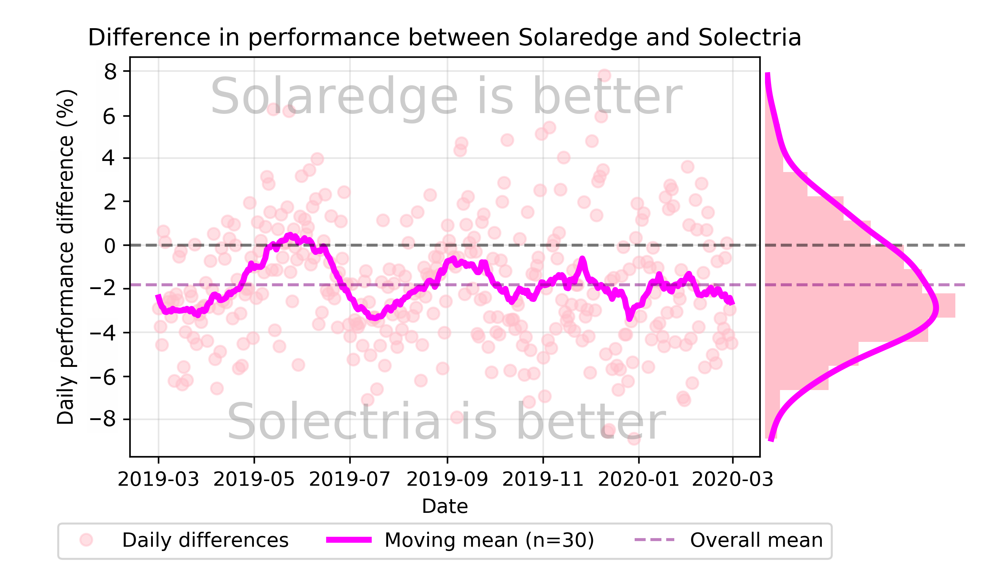
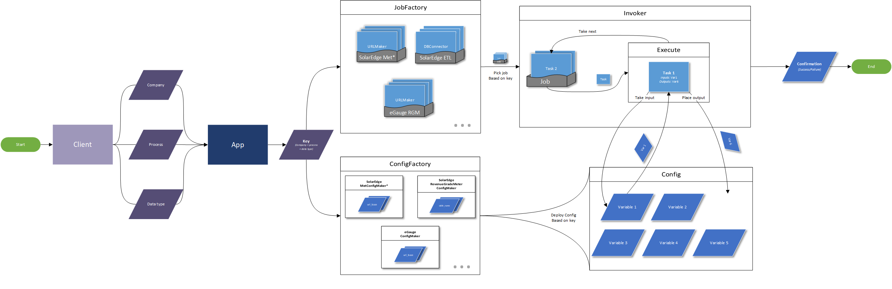

# Daniel Bredun

[LinkedIn Profile](https://www.linkedin.com/in/daniel-bredun/)

[Github Profile](https://github.com/Breedoon/)

## Portfolio

### Data Science

- [Machine Learning Projects](https://github.com/Breedoon/MachineLearningProjects/): A collection of exploratory projects solving a wide range of problems with various Machine Learning techniques.
- [UserEngagement](https://github.com/Breedoon/UserEngagement): A project on determining the most important factors influencing user adoption based on usage data of a given product using Logistic Regression and Random Forests.
- [Github repo](https://github.com/Breedoon/SolarBears) with the code of the statistical analysis comparing two solar panel manufacturers, and an algorithm substantially optimizing fetching of the API of one of them.

### Data Visualization

- A [data visualization](#solar-panel-statistical-analysis-data-visualization) presenting the result of the statistical analysis comparing two solar panel manufacturers.
- Plotly-based [interactive graph](http://ec2-34-234-203-0.compute-1.amazonaws.com/demo.html) for investigating historic solar energy production data.
- [Data visualization](#noise-on-market-st-data-visualization) of recorded noise levels on Market Street, San Francisco.

### Data Engineering

- Diagram of the [Relational Database Architecture](#relational-database-architecture-for-solar-datawarehouse) of a data warehouse for collecting and processing big solar data, designed to handle various edge-cases in equipment-to-site relationships.

### Software Development

- Diagram demonstrating the object-oriented [data pipeline software architecture](#object-oriented-software-architecture-for-solar-api-data-pipeline) designed around reusability of the code to handle diverse data formats and APIs through the Command and Factory software design patterns.
- Django/Vue.js [web dashboard](http://ec2-34-234-203-0.compute-1.amazonaws.com/) used for monitoring day-to-day solar panels activity.
- [Chrome extension](http://ec2-34-234-203-0.compute-1.amazonaws.com/noise.html) redesigning and upgrading the university's online platform.

### Other

- [LinkedIn recommendation](#recommendation-from-the-manager) from the manager.

## Samples

### Solar Panel Statistical Analysis Data Visualization

### Noise on Market St Data Visualization

### Relational Database Architecture for Solar Datawarehouse

### Object-Oriented Software Architecture for Solar API Data Pipeline

### Recommendation from the Manager

Also available on [LinkedIn](https://www.linkedin.com/in/daniel-bredun/)

